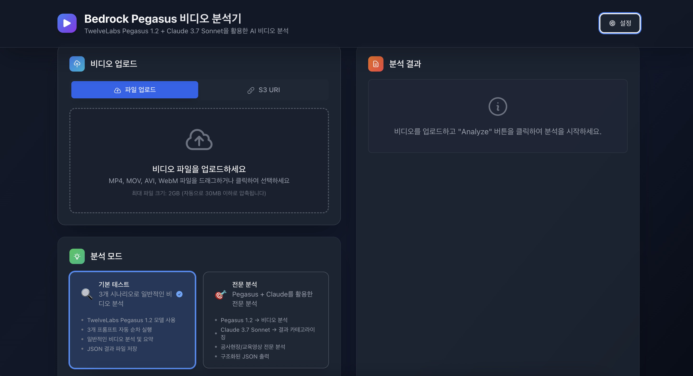

# Amazon Bedrock TwelveLabs Pegasus 1.2 비디오 분석기

Amazon Bedrock의 TwelveLabs Pegasus 1.2 모델과 Claude 3.7 Sonnet을 활용한 **현대적인 웹 기반 비디오 분석 시스템**입니다.



## ✨ 주요 특징

### 🎯 **직관적인 사용자 플로우**
- **파일 선택**: 드래그 앤 드롭으로 비디오 파일 선택 (즉시 업로드 안 함)
- **분석 시작**: Analyze 버튼 클릭 시 업로드 → 인코딩 → 분석 순차 진행
- **실시간 피드백**: 각 단계별 진행률을 시각적으로 표시
- **S3 URI 지원**: 기존 S3 저장 비디오 직접 접근

### 🔧 **스마트 비디오 처리**
- **자동 파일 크기 감지**: 70MB 이상 파일 자동 S3 업로드
- **Base64 vs S3 URI**: 파일 크기에 따른 최적 전송 방식 자동 선택
- **실시간 인코딩**: FFmpeg 기반 비디오 압축 (선택사항)
- **진행률 추적**: 업로드, 인코딩, 분석 각 단계별 실시간 상태 표시

### 🤖 **이중 AI 파이프라인**
- **1단계**: TwelveLabs Pegasus 1.2로 비디오 → 텍스트 분석
- **2단계**: Claude 3.7 Sonnet으로 텍스트 → 구조화된 JSON 변환
- **전문 분석**: 건설현장/교육영상 특화 분석
- **기본 테스트**: 3개 시나리오 자동 실행

### 🎨 **현대적인 UI/UX**
- **다크 테마**: 눈에 편안한 전문적인 디자인
- **글래스모피즘**: 반투명 카드와 백드롭 블러 효과
- **탭 기반 입력**: 파일 업로드 vs S3 URI 선택
- **반응형 디자인**: 모든 화면 크기에 최적화
- **설정 모달**: 실시간 시스템 설정 조정

## 🚀 빠른 시작

### 사전 요구사항
1. **AWS 자격 증명**: `aws configure`로 설정
2. **Bedrock 모델 액세스**: TwelveLabs Pegasus 1.2 + Claude 3.7 Sonnet 활성화
3. **Python 3.8+** 및 **Node.js 18+**
4. **S3 버킷**: 큰 파일 처리용 (자동 생성 가능)
5. **ffmpeg** (선택사항, 비디오 인코딩용)

### 설치 및 실행

#### 1. 프로젝트 클론
```bash
git clone https://github.com/jesamkim/bedrock-pegasus-video-analyzer.git
cd bedrock-pegasus-video-analyzer
```

#### 2. S3 버킷 생성 (선택사항)
```bash
# 자동 S3 버킷 생성 및 설정
python create_s3_bucket.py
```

#### 3. 백엔드 설정
```bash
# Python 가상환경 생성
python -m venv venv
source venv/bin/activate  # Windows: venv\Scripts\activate

# 의존성 설치
pip install -r requirements.txt

# 백엔드 서버 실행
cd video-analyzer-ui/backend
python main.py
```

#### 4. 프론트엔드 설정
```bash
# 새 터미널에서
cd video-analyzer-ui/frontend

# 의존성 설치
pnpm install

# 프론트엔드 서버 실행
pnpm run dev
```

#### 5. 웹 애플리케이션 접속
- **메인 UI**: http://localhost:5173
- **API 문서**: http://localhost:8000/docs

## 📋 사용 방법

### 🎯 **기본 워크플로우**

#### **1. 비디오 입력 방식 선택**
- **파일 업로드 탭**: 로컬 비디오 파일 드래그 앤 드롭
- **S3 URI 탭**: 기존 S3 저장 비디오 URI 입력

#### **2. 파일 선택 (업로드 안 됨)**
- 파일 선택 시 즉시 업로드되지 않음
- 선택된 파일 정보만 표시
- 지원 형식: MP4, MOV, AVI, WebM

#### **3. 분석 모드 선택**
- **기본 테스트**: 3개 프롬프트 자동 실행
- **전문 분석**: Pegasus + Claude 이중 파이프라인

#### **4. 프롬프트 편집 (선택사항)**
- 분석 질문 사용자 정의
- 실시간 편집 및 미리보기

#### **5. 분석 실행**
- **"Analyze" 버튼 클릭**: 전체 프로세스 시작
- **업로드 진행률**: 원형 진행률 표시 (0-100%)
- **인코딩 진행률**: 모달 창으로 표시 (70MB 이상 파일)
- **분석 진행률**: AI 모델 처리 상태 표시

#### **6. 결과 확인**
- 구조화된 JSON 결과 표시
- 복사, 다운로드 기능 제공
- 분석 통계 및 메타데이터 포함

### 🔧 **시스템 설정**

우측 상단 설정 버튼(⚙️)을 통해 다음 항목들을 실시간 조정할 수 있습니다:

#### **AWS 설정**
- **AWS 리전**: 기본값 us-west-2
- **Pegasus 모델 ID**: us.twelvelabs.pegasus-1-2-v1:0
- **Claude 모델 ID**: us.anthropic.claude-3-7-sonnet-20250219-v1:0
- **S3 버킷**: bedrock-pegasus-video-temp

#### **비디오 압축 설정**
- **최대 파일 크기**: 70MB (기본값)
- **프레임레이트**: 12fps (기본값)
- **CRF 품질**: 30 (18-51, 낮을수록 고품질)
- **해상도**: 854:480 (기본값)
- **인코딩 프리셋**: fast (기본값)

## 🏗️ 시스템 아키텍처

### 전체 구조
```
┌─────────────────┐    ┌──────────────────┐    ┌─────────────────────┐
│   사용자 입력    │    │   웹 인터페이스   │    │   백엔드 API        │
│                 │    │                  │    │                     │
│ • 파일 선택      │───▶│ • React + TS     │───▶│ • FastAPI          │
│ • S3 URI       │    │ • Tailwind CSS   │    │ • Python           │
│ • 설정 조정      │    │ • 다크 테마       │    │ • 비동기 처리       │
└─────────────────┘    └──────────────────┘    └─────────────────────┘
                                │                         │
                                ▼                         ▼
                       ┌──────────────────┐    ┌─────────────────────┐
                       │   파일 처리       │    │    AI 분석          │
                       │                  │    │                     │
                       │ • 자동 업로드     │◀───│ • Pegasus 1.2      │
                       │ • S3 저장        │    │ • Claude 3.7 Sonnet│
                       │ • 인코딩 (선택)   │    │ • 진행률 추적       │
                       └──────────────────┘    └─────────────────────┘
```

### 분석 파이프라인

#### **기본 테스트 모드**
```
파일 선택 → Analyze 클릭 → 업로드 → 인코딩(선택) → Pegasus 1.2 (3개 프롬프트) → JSON 결과 (3개 파일)
```

#### **전문 분석 모드**
```
파일 선택 → Analyze 클릭 → 업로드 → 인코딩(선택) → Pegasus 1.2 → Claude 3.7 Sonnet → 구조화된 JSON
```

### 파일 처리 로직

#### **파일 크기별 처리 방식**
- **≤ 70MB**: Base64 인코딩으로 직접 전송
- **> 70MB**: 자동 S3 업로드 후 S3 URI 사용
- **인코딩 필요시**: FFmpeg로 압축 후 재평가

## 📊 분석 결과 예시

### 전문 분석 결과 (건설현장)
```json
{
  "video_type": "공사현장",
  "construction_info": {
    "work_type": ["토공"],
    "equipment": {
      "excavator": 3,
      "dump_truck": 2
    },
    "filming_technique": ["Oblique View"]
  },
  "confidence_score": 0.9
}
```

### 전문 분석 결과 (교육영상)
```json
{
  "video_type": "교육영상",
  "construction_info": {
    "work_type": ["교량공"],
    "equipment": {
      "crane": "불명확",
      "dump_truck": "불명확"
    }
  },
  "educational_info": {
    "content_type": "교량 건설 과정 및 기술 교육",
    "slide_content": "GPS 위치 탐색, 철제 강관 설치, 안전도 검사..."
  },
  "confidence_score": 0.85
}
```

### 기본 테스트 결과 (실제 예시)
```json
{
  "basic_results": [
    {
      "prompt": "이 비디오에서 무엇을 볼 수 있나요?",
      "response": "이 비디오에서는 AWS Presentation Script Generator 웹사이트를 사용하여 프레젠테이션 스크립트를 생성하는 과정을 볼 수 있습니다..."
    },
    {
      "prompt": "주요 활동이나 이벤트는 무엇인가요?",
      "response": "주요 활동은 Amazon Bedrock을 활용한 프레젠테이션 스크립트 생성 과정입니다..."
    },
    {
      "prompt": "비디오의 전반적인 내용을 요약해주세요.",
      "response": "비디오는 Amazon Bedrock을 사용하여 프레젠테이션 스크립트를 생성하는 과정을 보여줍니다..."
    }
  ]
}
```

## 🛠️ 기술 스택

### **프론트엔드**
- **React 18** + **TypeScript**
- **Tailwind CSS** (다크 테마)
- **Headless UI** (모달, 다이얼로그)
- **React Query** (상태 관리 및 캐싱)
- **Heroicons** (아이콘)
- **React Dropzone** (파일 업로드)

### **백엔드**
- **FastAPI** (Python 웹 프레임워크)
- **boto3** (AWS SDK)
- **ffmpeg** (비디오 인코딩, 선택사항)
- **asyncio** (비동기 처리)
- **Pydantic** (데이터 검증)

### **AI 모델**
- **TwelveLabs Pegasus 1.2**: 비디오 이해 및 분석
- **Claude 3.7 Sonnet**: 텍스트 구조화 및 분류

### **AWS 서비스**
- **Amazon Bedrock**: AI 모델 호스팅
- **Amazon S3**: 비디오 파일 저장 (큰 파일용)
- **AWS STS**: 계정 인증

## 📁 프로젝트 구조

```
bedrock-pegasus-video-analyzer/
├── README.md                           # 이 파일
├── img/
│   └── screenshot.png                  # UI 스크린샷
├── config.py                          # 설정 파일
├── create_s3_bucket.py                 # S3 버킷 자동 생성 스크립트
├── sample.mp4                          # 테스트용 비디오 파일 (71.68MB)
├── bedrock_pegasus_test.py            # 기본 테스트 (CLI)
├── bedrock_pegasus.py                 # 전문 분석 (CLI)
├── requirements.txt                   # Python 의존성
├── video-analyzer-ui/                 # 웹 애플리케이션
│   ├── backend/                       # FastAPI 백엔드
│   │   ├── main.py                    # 메인 서버
│   │   ├── video_encoder.py           # 비디오 인코딩
│   │   ├── backend.log                # 서버 로그
│   │   └── requirements.txt           # 백엔드 의존성
│   └── frontend/                      # React 프론트엔드
│       ├── src/
│       │   ├── components/            # UI 컴포넌트
│       │   │   ├── VideoUpload.tsx    # 파일 업로드 컴포넌트
│       │   │   ├── AnalysisResults.tsx # 결과 표시 컴포넌트
│       │   │   └── SettingsModal.tsx  # 설정 모달
│       │   ├── hooks/                 # React 훅
│       │   │   └── useAnalysis.ts     # 분석 상태 관리
│       │   ├── services/              # API 서비스
│       │   ├── types/                 # TypeScript 타입
│       │   └── App.tsx                # 메인 앱
│       ├── package.json
│       ├── tailwind.config.js
│       └── frontend.log               # 프론트엔드 로그
```

## 🎯 사용 사례

### **일반 비디오 분석**
- 프레젠테이션 내용 분석
- 교육 자료 요약
- 회의 내용 정리
- 데모 영상 분석

### **건설 현장 관리**
- 현장 작업 진행 상황 자동 모니터링
- 건설 투입 장비 현황 파악
- 안전 관리 및 규정 준수 확인
- 작업 기법 분석 (Bird View, Oblique View 등)

### **교육 및 훈련**
- 건설 교육 콘텐츠 자동 분류
- 교육 자료 메타데이터 생성
- 슬라이드 내용 자동 추출
- 학습 진도 추적


## ⚙️ 고급 설정

### 환경변수 설정
```bash
# AWS 설정
export AWS_REGION=us-west-2
export AWS_ACCOUNT_ID=your-account-id

# S3 버킷 설정
export VIDEO_ANALYSIS_BUCKET=bedrock-pegasus-video-temp

# 모델 ID 설정 (선택사항)
export PEGASUS_MODEL_ID=us.twelvelabs.pegasus-1-2-v1:0
export CLAUDE_MODEL_ID=us.anthropic.claude-3-7-sonnet-20250219-v1:0
```

### config.py 사용자 정의
```python
# AWS 설정
AWS_REGION = "us-west-2"
S3_BUCKET = "bedrock-pegasus-video-temp"

# 모델 ID 설정
PEGASUS_MODEL_ID = "us.twelvelabs.pegasus-1-2-v1:0"
CLAUDE_MODEL_ID = "us.anthropic.claude-3-7-sonnet-20250219-v1:0"

# 비디오 압축 설정
VIDEO_COMPRESSION_SETTINGS = {
    "max_size_mb": 70,        # 목표 파일 크기
    "crf": 30,                # 품질 (낮을수록 고품질)
    "preset": "fast",         # 인코딩 속도
    "resolution": "854:480",  # 해상도
    "framerate": 12           # 프레임레이트
}

# 파일 크기 임계값
BASE64_LIMIT_MB = 70  # 이 크기 이상이면 S3 URI 사용
```

## 🔧 문제 해결

### 일반적인 오류

#### **1. 모델 액세스 오류**
```
Error: Model access denied
```
**해결방법**: AWS 콘솔 → Bedrock → Model access에서 모델 활성화

#### **2. S3 접근 오류**
```
Error: Cannot access S3 object
```
**해결방법**: 
- S3 버킷 읽기 권한 확인
- `python create_s3_bucket.py` 실행
- bucketOwner 설정 확인

#### **3. 파일 크기 제한 오류**
```
Error: Value at 'body' failed to satisfy constraint: Member must have length less than or equal to 100000000
```
**해결방법**: 
- 70MB 이상 파일은 자동으로 S3 URI 사용
- config.py에서 BASE64_LIMIT_MB 조정

#### **4. ffmpeg 없음 경고**
```
Warning: FFmpeg not available
```
**해결방법**: 
- macOS: `brew install ffmpeg`
- Ubuntu: `apt-get install ffmpeg`
- Amazon Linux: 소스 컴파일 또는 원본 파일 사용

#### **5. CORS 오류**
```
Error: CORS policy blocked
```
**해결방법**: 백엔드 CORS 설정 확인 (localhost:5173 허용)

#### **6. 설정 로드 오류**
```
Error: 설정 로드 중 오류가 발생했습니다
```
**해결방법**: 
- 백엔드 서버 재시작
- `/api/config` 엔드포인트 확인

### 디버깅 방법

#### **백엔드 로그 확인**
```bash
cd video-analyzer-ui/backend
tail -f backend.log
```

#### **프론트엔드 로그 확인**
```bash
cd video-analyzer-ui/frontend
tail -f frontend.log
```

#### **브라우저 개발자 도구**
- **F12** → Console 탭에서 JavaScript 에러 확인
- **Network** 탭에서 API 요청/응답 확인
- **Application** 탭에서 로컬 스토리지 확인

#### **API 테스트**
```bash
# 서버 상태 확인
curl http://localhost:8000/

# 설정 확인
curl http://localhost:8000/api/config

# 파일 업로드 테스트
curl -X POST -F "video=@sample.mp4" http://localhost:8000/api/upload
```

## 🚀 성능 최적화

### **비디오 처리 최적화**
- **자동 파일 크기 감지**: 70MB 임계값으로 최적 처리 방식 선택
- **S3 업로드 최적화**: 큰 파일 자동 S3 저장
- **병렬 처리**: 비동기 인코딩 및 분석
- **진행률 추적**: 실시간 상태 업데이트

### **UI 성능 최적화**
- **React Query**: 효율적인 상태 관리 및 캐싱
- **코드 분할**: 필요한 컴포넌트만 로드
- **이미지 최적화**: WebP 형식 및 지연 로딩
- **메모이제이션**: 불필요한 리렌더링 방지

### **API 최적화**
- **백그라운드 태스크**: 긴 작업의 비동기 처리
- **진행률 폴링**: 효율적인 상태 확인
- **에러 처리**: 단계별 상세한 에러 메시지
- **캐싱**: 분석 결과 임시 저장


## 📄 라이선스

이 프로젝트는 MIT 라이선스 하에 배포됩니다. 자세한 내용은 [LICENSE](LICENSE) 파일을 참조하세요.


